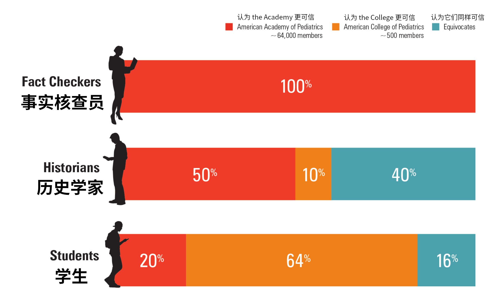
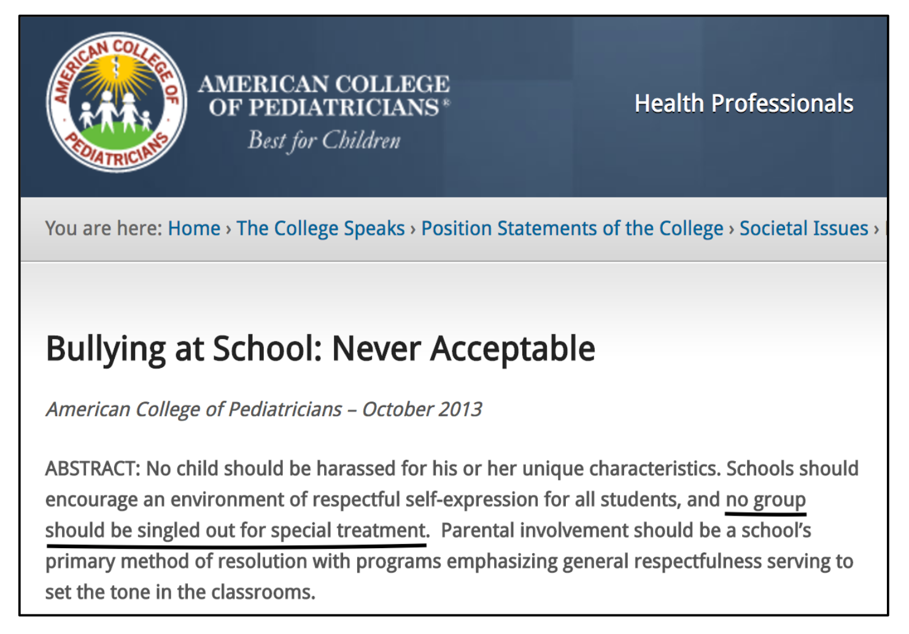
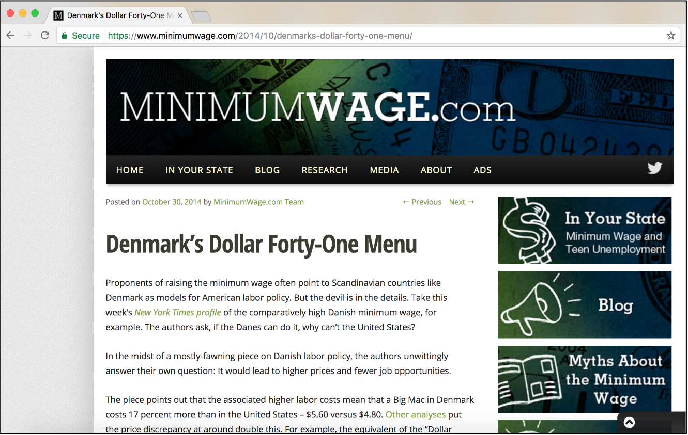
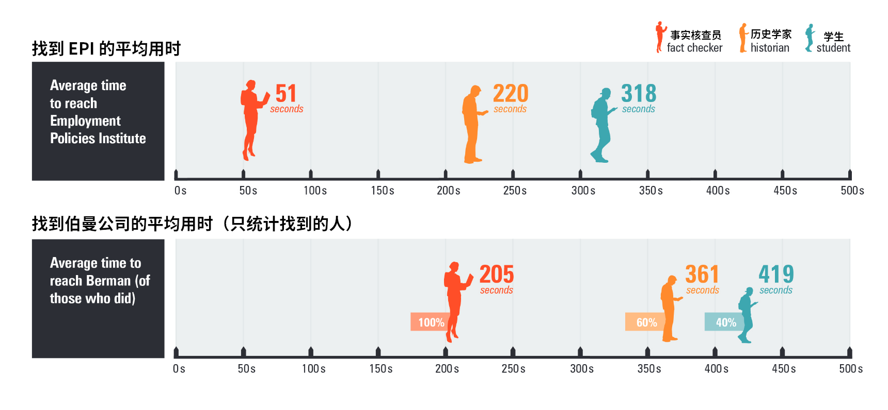
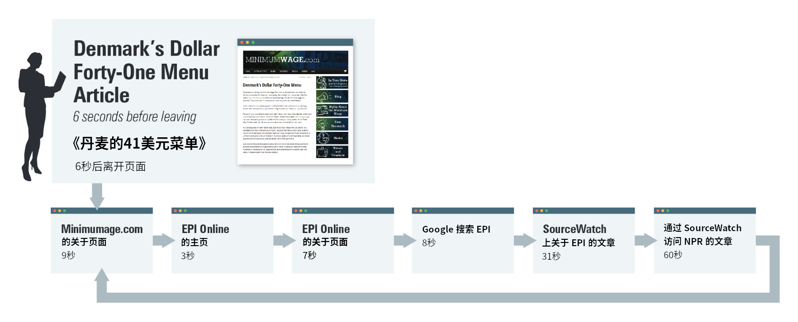
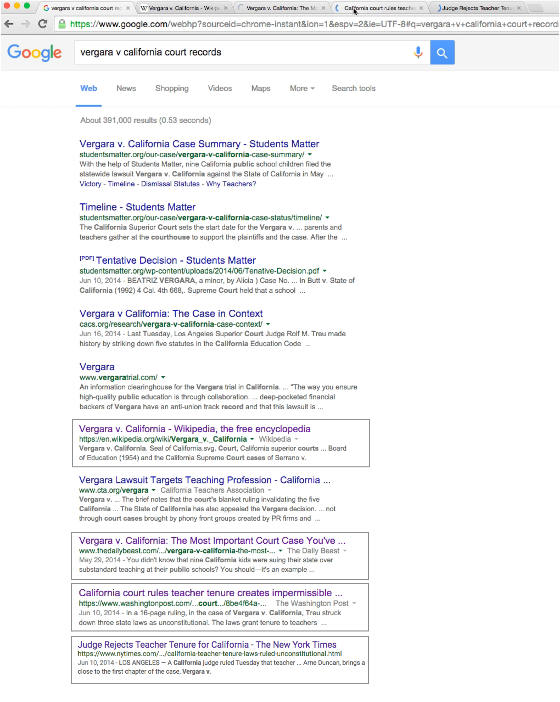

# 横向阅读：在评估数字信息时少读多学 

这是对 [斯坦福大学历史教育小组](https://sheg.stanford.edu/) 于 2017 年发表的文章 “Lateral Reading: Reading Less and Learning More When Evaluating Digital Information” 的中文翻译。

译者：Shelling <cjybyjk@zjnu.edu.cn>

原文链接：[https://ssrn.com/abstract=3048994](https://ssrn.com/abstract=3048994)

**本译文会将原文中的一些关键词链接到维基百科或其他站点以供读者参考。译者不对链接到的页面内容的准确性作任何保证。**

由于译者水平不足，翻译中可能会有一些错误。如果你发现了，请联系我进行修正。

---

## 摘要
互联网在使人们更容易获取信息的同时，也为虚假信息、假新闻和伪装成冷静分析的宣传提供了传播条件。为了调查人们如何确定信息的可信度，我们对 10 位历史学博士、10 位专业的事实核查员和 25 位斯坦福大学本科生进行了抽样调查。通过观察他们对网站的评估和对社会与政治问题的搜索，我们发现历史学家和学生经常成为仿冒网站的受害者，因为这些网站通常有着看起来很正式的标志和域名。与其他小组相比，事实核查员花了很少的时间就得出了更多有价值的结论。我们将从事实核查员的实践中收集到的见解与网络可信度教学的常见方法进行了对比。

## 正文
2010 年 10 月，《华盛顿邮报》报道了关于一本四年级历史教科书 《我们的弗吉尼亚：过去与现在》（“Our Virginia: Past and Present”）的故事。该书声称，成千上万的非裔美国人为[南方邦联](https://zh.wikipedia.org/wiki/%E7%BE%8E%E5%88%A9%E5%A0%85%E8%81%AF%E7%9B%9F%E5%9C%8B)而战，“包括[石墙杰克逊](https://zh.wikipedia.org/wiki/%E7%9F%B3%E7%89%86%E5%82%91%E5%85%8B%E6%A3%AE)指挥下的两个黑人营” (Sieff, 2010)。由于杰克逊在 1863 年 5 月 10 日死于友军炮火，这些“黑人邦联”不得不在内战最激烈的时候拿起武器，而当时联邦军还在争论招募非裔美国士兵的问题。

然而这种说法并没有证据支持。唯一涉及黑人士兵征兵的南方邦联文件是[罗伯特·爱德华·李](https://zh.wikipedia.org/wiki/%E7%BE%85%E4%BC%AF%E7%89%B9%C2%B7E%C2%B7%E6%9D%8E)在阿波马托克斯投降前 17 天发布的“第 14 号命令”。这是其阻止北方联邦的最后努力。 尽管几乎所有的希望都破灭了，这项提议仍然备受争议，南方邦联的领导人认为有必要发表一个免责声明：“这项法案中的任何内容都不应被解释为授权改变上述奴隶与奴隶主之间的关系。”<a id="orig_1" href="#footer_1">1</a> 

那么，关于“成千上万的非裔美国人为南方邦联而战”的说法是如何进入教学材料的呢？

当被问及她的资料来源时，作者乔伊·马索夫（Joy Masoff）向华盛顿邮报解释说她在网上进行了研究。她的资料来源是“邦联老兵之子”的网站：“一个爱国、历史和教育组织，成立于 1896 年，致力于纪念邦联士兵和水手的牺牲并保护南方文化” (Sons of Confederate Veterans, 1997) 。

有些人可能会说乔伊·马索夫 —— 一个“数字移民” (Prensky, 2001)， 不是她如今学生的对手。因为现在的学生们几乎一出生就盯着屏幕，不会被这样的诡计欺骗。然而，当“数字原住民”们的能力受到考验时，却一次又一次的证明这个看法是错误的 (Bennett, 2012; Gasser, Cortesi, Malik, & Lee, 2012; Helsper & Eynon, 2009) 。事实证明，学生们在网上收集和评估信息时几乎在各个方面都很吃力。在研究了大学生如何使用学术数据库后，Asher 和 Duke (2011) (p. 73) 总结道:“大多数学生……在搜索过程的几乎每个地方都表现出极大困难”。当搜索引擎没有返回想要的结果时，他们很快就放弃了搜索，只依赖结果的第一页，并且主要基于文章的标题和摘要来判断文章的可信度。

在迄今为止最广泛的使用[出声思维法（Think-Aloud）](https://zh.wikipedia.org/wiki/%E5%87%BA%E5%A3%B0%E6%80%9D%E7%BB%B4%E6%B3%95)的研究中，Hargittai, Fullerton, Menchen-Trevino, and Thomas (2010) 观察了 100 多名大学生在网上搜索的情况。这次研究的屏幕录像和录音提供了大量的数据，包括超过 80 小时的录音和 770 页的采访记录。研究发现，学生们绝大多数都把决定信息可信度的任务交给了谷歌 —— 信息在谷歌结果中排名越高，他们就认为该网站越可靠。另一项研究发现，本科生忽略了谷歌的摘要（每个结果附带的几句话）中包含的有价值的信息，而选择那些排名更高的网站，即使它们“与任务不太相关” (Pan, Hembrooke, & Joachims, 2007, p. 816)。

Wiley 等人 (2009) 发现，大学生在评估可信度时很少考虑信息的来源。在不同年龄和不同国家的一系列研究中得到了相同的结果 (例如 Barzilai & Zohar, 2012; List, Grossnickle, & Alexander, 2016; Walraven, Brand-Gruwel & Boshuizen, 2009)。年轻人更有可能根据网站与搜索需求的相关性 (Iding, Crosby, Auernheimer,& Klemm, 2009; Julien & Barker, 2009; Walraven et al., 2009)、外观或导航的难易程度来判断网站。

这些研究主要针对典型用户，而关于熟练用户的研究相对较少。Lucassen and Schraagen (2011) 将活跃在汽车爱好者论坛上的人们作为具有汽车发动机专业知识的代表进行了研究。不出所料，对汽车了解更多的人比那些了解较少的人更能在维基百科上发现错误。同样，一组荷兰研究人员比较了心理学专业的学生和教师在选择心理学主题的在线资源时的差异，发现了教师花更长时间浏览搜索结果，而学生的评估则浮于表面 (Brand-Gruwel, Kammerer, van Meeuwen, & van Gog, 2017)。在另一项研究中，研究人员指定一组教育技术领域的研究生为“专家”，并将他们的在线研究过程与大学新生 (“新手”)的在线研究过程进行了比较 (Brand-Gruwel, Wopereis, & Vermetten, 2005)。但是对于专家们如何选择和评估信息，作者们几乎没有提供什么线索。
 
这项研究旨在更详细地了解专家们在判断网上信息时所做的工作。不过，在解决这个问题之前，我们需要弄清楚谁有资格成为专家。

我们求助于一群以评估资料来源为生的专业人士：历史学家。大量的研究已经确定了历史学家是如何获取文献的，查找文献的作者及其创作环境是确定其可信度的关键 (Wineburg, 1991a, 1998; Leinhardt & Young, 1996; Shanahan & Shanahan, 2008) Shanahan, Shanahan 和 Misischia (2011) 发现不同领域的学者在查找资料方面存在很大差异。数学家明确忽视论文的作者，因为它“只会分散注意力，对理解文章毫无帮助”。历史学家则选择“广泛的来源”，推测“这篇材料的作者是谁，以及他或她代表了什么”

尽管数字历史有所发展，但大多数历史学家仍然在纸质文献档案中进行研究。 因此，我们开始研究另一组主要在电脑屏幕上完成工作的人：事实核查员，他们的工作是以数字方式查明真相。这些专业人员负责评估断言和证据，并花费大量时间浏览数字信息。

最后，我们招募了第三组参与者：斯坦福大学的本科生。2016年，斯坦福大学拒绝了 95% 的申请者，使其成为美国最具竞争力的大学。 几乎所有被录取的学生都在高中班级中名列前 10%，并且在 SAT 中的得分高于 90% (Stanford University, 2015)。这些年轻人就读于硅谷中心的一所大学，科技创业公司在校园实验室内萌芽，而计算机科学是最受欢迎的专业 (Stanford University, 2017)。他们不是普通的“数字原住民”，而是来自其中的顶峰，并被指定 —— 至少根据斯坦福大学的宣传册所说 —— 将引领数字未来。 

### 方法
#### 参与者
- **历史学家** 我们招募了 10 名历史学家，他们都拥有历史博士学位，并在加州或华盛顿州的四年制学院和大学任教。男性 6 人，女性 4 人。他们的年龄从 39 岁到 69 岁不等 (M = 47)。 
- **事实核查员** 我们招募了受雇于著名的新闻和政治事实核查组织的事实核查员。其中 8位位于纽约市或华盛顿特区，2 位位于西海岸。与历史学家一样，有 6 名男性和 4 名女性。他们的年龄从 23 岁到 60 岁不等 (M = 34)。两名参与者持有硕士学位，一名持有博士学位，其余 7 位拥有学士学位。
- **大学生** 我们通过在校园内张贴传单招募学生参与，每个人都获得了一张价值 25 美元的亚马逊礼品卡。所有学生都在第一学年的第二或第三季度入学，年龄在 18 至 19 岁之间。其中有 11 名男性，13 名女性与 1 名非二元性别者。每位学生都表示每天至少上网 4 小时。

#### 实验方法
我们开发了六个在线任务，大约需要 45 分钟才能完成。我们关注的是对有关社会和政治问题的数字资源的评估。由于篇幅限制，我们将这里的讨论范围缩小到参与者完成的三个主要任务（见表 1）<a id="orig_2" href="#footer_2">2</a> 。

**表 1. 主要网络评估**

| 主题 | 目标 | 参与者可以做的事 |
| - | - | - |
| 校园欺凌 网址:  [https://www.acpeds.org/the-college-speaks/position-statements/societal-issues/bullying-at-school-never-acceptable](https://www.acpeds.org/the-college-speaks/position-statements/societal-issues/bullying-at-school-never-acceptable) [https://www.aap.org/en-us/about-the-aap/aap-press-room/pages/Stigma-At-the-Root-of-Ostracism-and-Bullying.aspx](https://www.aap.org/en-us/about-the-aap/aap-press-room/pages/Stigma-At-the-Root-of-Ostracism-and-Bullying.aspx) | 对网站进行内部和外部评估；比较网站 | 滚动页面，点击链接，离开网站以访问任何在线信息 时间限制：10 分钟 |
| 最低工资政策 网址：[https://www.minimumwage.com/2014/10/denmarks-dollar-forty-one-menu/](https://www.minimumwage.com/2014/10/denmarks-dollar-forty-one-menu/) | 对网站进行内部和外部评估 | 滚动页面，点击链接，离开网站以访问任何在线信息 时间限制：5 分钟 |
| 教师任期 对[韦加拉诉加利福尼亚案](https://en.wikipedia.org/wiki/Vergara_v._California)原告的资助 | 打开网络搜索，找出谁为 120 万美元的诉讼费买单 | 在线访问任何信息 时间限制：5 分钟 |

#### 流程
作者与历史学家和事实核查员进行了会谈；与学生的会议由作者之一和研究团队的其他成员进行。参与者被要求在 13 英寸 MacBook Air 上完成一系列基于网络的任务。网站是真实的，参与者可以像往常一样搜索互联网 —— 点击链接，打开新标签，离开网站去其他地方搜索。鼓励参与者在评估信息和确定其可信度时做他们通常会做的事情。此外，他们还被要求在完成任务时口头表达他们的想法 (Ericsson & Simon, 1993; Pressley & Afflerbach, 1995)<a id="orig_3" href="#footer_3">3</a>。

我们使用了各种提示来鼓励自然行为，包括：“你可以打开新的标签 —— 做任何你通常会做的事情来了解一个网站”和 “我们对你的看法感兴趣。你可以停留在这个网页上，或者去另一个网站，做任何你通常会做的事情。”我们在每个任务的开始都重复了这些指示。我们还指出了每项任务的时间限制，并在到达时限前一分钟给参与者警告。我们设置时间限制是因为人们愿意花在网站上的时间一般都很短 —— 只有几秒钟 (Haile, 2014; Nielson, 2011)。微软的研究人员发现，在用户访问的 205873 个页面中，80% 的页面的停留时间不超过 70 秒 (Liu, White, & Dumais, 2010, p. 382)。有效的搜索和评估策略对于任何试图管理屏幕上泛滥的信息的人来说都是至关重要的。

我们使用 QuickTime Player 10 来录制音频和电脑屏幕，同时还用 iPhone 6 为每一次测试进行录像，防止 QuickTime 音频丢失的情况

#### 数据分析
我们制定了评分标准来评价参与者在每项任务中的结论质量。这些评分标准是在与博士研究生和大学教授进行广泛的试验后制定的（我们会在描述每项任务的章节中更详细地描述这些评分标准）。

两名程序员（第二作者和一名没有参与创建评分标准的研究助理）测试了[评分者间信度](https://en.wikipedia.org/wiki/Inter-rater_reliability)。我们对大约四分之一的数据进行了测试，在三项任务中取得了 92% 的评分者间信度 ([Cohen's Kappa](https://en.wikipedia.org/wiki/Cohen%27s_kappa) = 0.90)。

其他分析因任务而异。这些分析包括计算参与者得出结论所花的时间；他们是否在一个网站上停留；如果他们离开，他们还访问了哪些网站，以及他们是否采取了措施来了解他们所访问的网站背后的个人或团体。

### 测试结果
#### 任务 1：欺凌
参与者评估了美国儿科学会 (the American Academy of Pediatrics，以下简称 **the Academy** ) 和美国儿科医师协会 (the American College of Pediatricians，以下简称 **the College** )网站上有关欺凌的文章。尽管名称相似，但这两个组织却大不相同。 **the Academy**  创立于 1932 年，它是世界上最大的儿科医生专业组织。它有 64000 名成员和 450 名带薪员工。 **the Academy**  出版的《儿科学》（*Pediatrics*）期刊是该领域的权威。该组织还提供从婴儿猝死综合症到青少年时期佩戴自行车头盔的重要性等方面的继续教育。

相比之下， **the College** 是于 2002 年因同性伴侣收养问题与 **the Academy** 产生分歧而分裂出的组织。据估计，该组织有 200 到 500 名成员，只有一名全职雇员，不出版期刊 (Throckmorton, 2011)。该组织因其激烈的反同性恋立场、倡导 “修复疗法”（目前在美国 9 个州禁止未成年人使用）和煽动性的帖子（其中一个主张在 [LGBT](https://zh.wikipedia.org/wiki/LGBT) 的缩写中加入代表[恋童癖](https://zh.wikipedia.org/wiki/%E6%81%8B%E7%AB%A5)的 P，因为恋童癖 “本质上与他们的议程交织在一起”）而受到严厉批评 (American College of Pediatricians, 2015)。[南方贫困法律中心](https://zh.wikipedia.org/wiki/%E5%8D%97%E6%96%B9%E8%B4%AB%E5%9B%B0%E6%B3%95%E5%BE%8B%E4%B8%AD%E5%BF%83) 因为其“使用具有欺骗性的命名”和“诋毁同性恋者”而将 **the College** 标记为[仇恨团体](https://zh.wikipedia.org/wiki/%E4%BB%87%E6%81%A8%E5%9C%98%E9%AB%94) (Lenz, 2012; Southern Poverty Law Center, 2016)。 **the College** 对青年 LGBT 研究结果的描述激起了美国顶尖科学家的愤怒，其中包括[美国国家卫生研究院](https://zh.wikipedia.org/wiki/%E5%9C%8B%E5%AE%B6%E8%A1%9B%E7%94%9F%E9%99%A2_(%E7%BE%8E%E5%9C%8B))前任院长[弗朗西斯·柯林斯（Francis Collins）](https://zh.wikipedia.org/wiki/%E6%B3%95%E8%98%AD%E8%A5%BF%E6%96%AF%C2%B7%E6%9F%AF%E6%9E%97%E6%96%AF)，他写道：“美国儿科医师协会 ( **the College** ) 从我写的一本书中断章取义……来支持一种可能造成不必要的痛苦和鼓励偏见的意识形态。他们提供的信息是具有误导性的。” (引用自 Bradshaw, Weight, & Packard, March 3, 2011)<a id="orig_4" href="#footer_4">4</a> 

快速浏览一下 **the College** 的网站，你可能会认为它是一个政治中立的医疗组织 (Turban, 2017)。该网站带有一个看起来很正式的标志和座右铭“最适合孩子 (Best for Children.)”。 一个温和的“关于我们”页面告诉读者， **the College** “根据现有的最佳研究，制定了合理的政策，以在养育子女方面帮助父母和影响社会”。同时， **the College** 并不掩饰自己的社会地位。“协会的使命”指出：“我们认识到，基本的由父母结婚组成的家庭是儿童成长的最佳环境”。 **the College** 的“立场声明”对从堕胎（过早和不必要地结束人的生命）到体罚（在某些情况下有效）等一系列问题的立场都毫无掩饰。

参与者首先评估了 **the College** 网站上一篇题为《校园欺凌：决不能接受》（“Bullying at School: Never Acceptable”）的文章。文章的“预防”一节中建议学校不要承认任何学生“特别有被欺负的危险”：
> 通过将项目重点放在一个学生或团体的特殊特征或活动上，学校为其倡导者推动的其他项目打开了通道，即涉及宗教、种族、身材、智力、种族甚至运动能力的问题。相反，通过将反欺凌项目的重点放在普遍尊重的主题上，学校……避免了对特定群体过度关注或冒险进行有争议的教学的陷阱。 (Trumbull, 2013)

多项研究表明，LGBT 的学生比他们的异性恋同龄人更容易受到欺负 —— 根据白宫欺凌问题会议引用的一项研究，超过 80% 的 LGBT 学生因为他们的性取向而受到 “口头骚扰”，超过 40% 的学生“在学校受到身体骚扰” (Espelage, 2011, p. 65)。然而， **the College** 暗示，关于“减少针对 LGBT 学生的欺凌”的项目相当于“特殊待遇”，这些项目可能“认可个人表现出的临时行为或取向” (Trumbull, 2013)。

拥有 64000 名成员的美国儿科学会（**the Academy**）的网站也带有标志和座右铭。网站还为会员提供资源和专业教育机会，包括会员详情、该组织自 1930 年成立以来的历史，以及浏览该学院出版的书籍和期刊的机会。参与者在 **the Academy** 网站上看到了一篇题为《污名化：排斥和欺凌的根源》（“Stigma: At the Root of Ostracism and Bullying”）的文章。这篇文章描述了一个研讨会，会上发表了六篇论文，包括《对非异性恋儿童和青年的歧视和污名化》（“Discrimination and Stigmatization of Non-heterosexual Children and Youth”）。其他主题侧重于可能使青年面临欺凌风险的因素，如体重、性取向、种族和收入。 (American Academy of Pediatrics, 2014)

在每个网站，参与者都有五分钟的时间来评估其作为有关欺凌的信息来源的可信度。如果他们在 10 分钟内没有明确的比较这两个网站，我们会问“如果你不得不说哪个网站更可靠，哪个更不可靠，你会怎么说？”

我们制定了一个评分标准来描述参与者得出的结论的质量：如果对网站的描述具体、正确、合理，我们就给两分；如果评价模糊或不确定，就给一分；如果参与者得出错误的结论（比如认为两个组织的可信度相同），就给零分。

[Kruskal-Wallis 检验](https://en.wikipedia.org/wiki/Kruskal%E2%80%93Wallis_one-way_analysis_of_variance)表明，参与者在 **the College** 网站上得出的结论存在显著差异：事实核查员得到了完美的平均分 —— 2分 (SD = 0)，而历史学家的平均分为 0.7 (SD = 0.95)，学生的平均分为 0.16 (SD = 0.37) (H(2) corrected for ties = 27.5, p < 0.001)

参与者在 **the Academy** 网站上得出的结论也存在显著差异 (H(2)corrected for ties = 25.2; p < 0.001)。事实核查员再次获得了满分 (M = 2, SD = 0)，历史学家的平均分为 1.2 分 (SD = 0.79)，而学生的得分为 0.4 (SD = 0.58)。后续的 [Mann-Whitney U 检验](https://en.wikipedia.org/wiki/Mann%E2%80%93Whitney_U_test)显示，在事实核查员和历史学家 (p = 0.01)、事实核查员和学生 (p < 0.001) 以及历史学家和学生 (p = 0.007) 之间存在显著差异。

参与者对哪个网站最可靠的判断存在着惊人的差异。每个事实核查员都毫无保留地认为 **the Academy** 的网站更可靠；历史学家们往往含糊其辞，表示相信两个网站都是可靠的；而学生们则绝大多数认为 **the College** 的网站更可靠（见图 1）。

**图 1. 各组参与者中选择 **the College** 或 **the Academy** 更可靠的百分比**

##### 确定方向 
事实核查员的成功与我们对*确定方向*的看法密切相关，这是从导航中借用的一个概念。有经验的徒步旅行者知道探索陌生的森林是多么容易迷路。只鲁莽的徒步旅行者才会相信自己的直觉，然后贸然前往。与之相反，有经验的旅行者们会通过旋转指南针来确定方向 —— 在正北方与目的地之间的夹角。显然，在网络上确定方向并不像测量角度那样精确。然而，它始于一个类似的前提：当在不熟悉的地形中前行时，首先要获得方向感。

事实核查员 C 的做法体现了确定方向的优势。他在 **the College** 的页面上只停留了 8 秒钟就去了其他地方。

“我要做的第一件事就是看看我能不能找到有关该组织的任何信息”他一边说，一边将组织的名称输入 Google。 他点击了维基百科关于 **the College** 的条目，读到它是一个“社会保守的儿科医生协会……成立于 2002 年……作为对 **the Academy** （原文为[American Academy’s]）支持同性伴侣收养的抗议。维基百科的条目链接到包括[《波士顿环球报》](https://zh.wikipedia.org/wiki/%E6%B3%A2%E5%A3%AB%E9%A0%93%E7%92%B0%E7%90%83%E5%A0%B1)的报道（“Beliefs drive research agenda of new think tanks”, Kranish, 2005) 、南方贫困法律中心的一份报告（“American College of Pediatricians Defames Gays and Lesbians in the Name of Protecting Children”, Lenz, 2012) 以及[美国公民自由联盟](https://zh.wikipedia.org/wiki/%E7%BE%8E%E5%9C%8B%E5%85%AC%E6%B0%91%E8%87%AA%E7%94%B1%E8%81%AF%E7%9B%9F)的简报（“Misinformation from Doctors...Out to Hurt Students?”, Coleman, 2010) 在内的来源。

整整一分二十秒后，核查员 C 才回到 **the College** 关于欺凌的文章中。在阅读他在任务开始时瞥见的摘要时（见图 2），他在看到 “任何群体都不应该被挑出来” 这句话时停顿了一下，说这“通常是指那些更容易被欺负的孩子 —— 有色人种或性少数学生” 并且补充说，“如果我只是看了[这篇关于欺凌的文章]，我永远不会知道这种事情。”

**图 2. 《校园欺凌：决不能接受》的摘要（已标出重点）**

在不到两分钟的时间里，核查员 C 做出的结论不仅是对这篇文章的准确评价，而且也是对 **the College** 网站其他部分的准确评价，整个网站都呈现出反同性恋的立场。<a id="orig_5" href="#footer_5">5</a> 总体而言，事实核查员们在大约半分钟内离开了 **the College** 的页面 (M = 32s, SD = 29s)。相比之下，历史学家们所花的时间几乎是其三倍 (M = 88s, SD = 103s)（10 人中只有 8 人离开页面）。16 名离开页面的学生（9 名从未离开过）平均花了 100 秒 (SD = 52s)。

事实核查员在离开登陆页面时的评论（见表 2）显示了他们立即想要确定方向的冲动。他们认为网络是一个充满了陷阱和死胡同的迷宫，事物并不总是像看上去那样。他们对不熟悉的事物的态度是谨慎的：虽然事情可能和看上去的一样，用核查员D的话说，“我总是想确认一下”。

**表 2. 事实核查员离开页面时的评论示例**

| 核查员 |  |
| - | - |
| A |我立即想了解更多关于 **the College** 的信息。所以我要去看看“关于我们”。 |
| D |我想知道某件事情是否可靠的第一个动作是点击“关于我们”的页面……从表面上看，美国儿科医师协会听起来很正式，但我总是想确认一下 |
| E | 我想了解更多关于美国儿科医师协会的信息 |
| H |很难说这个组织有多主流，所以我可能会打开另一个标签页，为了更多了解下这是主要的美国儿科医生专业组织，还是因为某种原因而分裂的团体。 |

##### 历史学家的阅读
十位历史学家中的两位在关于如何确定方向方面与事实核查员相似。在浏览了 20 秒之后，历史学家 H 离开了页面，然后打开了网站的“资源”标签，点击了指向 focusonthefamily.com (美国爱家协会) 的链接，确认了这实际上是布道家詹姆斯·多布森博士（Dr. James Dobson）创建的组织。他回到了网站的“资源”页面，但这一次带着一个假设：“他们可能有一个议程来治疗同性恋，这是另一种原教旨主义者的观点”。历史学家 S 也在不到半分钟的时间内离开了页面。在谷歌上搜索了该组织的名字后，他点击了[布赖特巴特新闻网](https://zh.wikipedia.org/wiki/%E5%B8%83%E8%B3%B4%E7%89%B9%E5%B7%B4%E7%89%B9%E6%96%B0%E8%81%9E%E7%B6%B2)的一篇头条新闻《美国儿科医师协会对同性婚姻的判决表态：美国儿童的悲剧之日》（“American College of Pediatricians On Same-Sex Marriage Ruling: A Tragic Day for America’s Children”）。他的结论是， **the College** 是“一个意识形态浓厚的地方”。

历史学家 H 和 S 是例外。当被问及是分裂组织（**the College**）的网站还是拥有 64000 名成员的 **the Academy** 的网站更值得信赖时，他们的五位同事含糊其辞。七位历史学家从未确定方向；一位在分析了四分钟的文章后才确定方向。经过十分钟的浏览，大多数学者对两个儿科组织各自的议程几乎一无所知。

历史学家经常被 **the College** 的名称和标志、其 .org 域名、网站布局，以及因为包括摘要、参考文献和由医生撰写的文章而看起来“科学的”外观所吸引。历史学家 M 在阅读“校园欺凌”一文时，对摘要和参考文献的存在进行了评论，将该网站与 [WebMD](https://en.wikipedia.org/wiki/WebMD) 进行了比较，并指出它的作者是一名医生（这是事实，但这不是她核实的，因为她从未离开这个页面）。她总结道：
> 我想我可能会觉得这篇文章很可靠，因为它是由专家撰写的，引用了专家的意见。它至少经过了儿科医师协会的一些人的审查。因此，这与专家的意见是一致的。但它仍然是一篇观点文章，它只是一篇我同意的观点文章，而且……反映了一个我想知道的群体的意见。

除了站点的表面特征、其对信息的表述以及作者姓名后列出的医学博士之外，历史学家 M 的结论没有任何依据。

在历史学家的判断中，有一个特征发挥了关键作用： **the College** 文章底部的参考文献的存在。10 位历史学家中有 7 位对其进行了明确的评论（见表 3），他们认为对《儿科学》和《犯罪学杂志》 (*Journal of Criminology*)等的引用，为文章内容赋予了合法性。

**表 3. 历史学家对参考文献的评论**

| 历史学家 | 评论 |
| - | - |
| A | 它引用了一些标准的科学文献，以支持它的一些主张，所以它有一种权威性的基调。 |
| B | 我会看一下参考文献，看看作者引用的是谁。 |
| E | 这些都是对专业期刊的引用，所以这无疑加强了我的感觉，即这是一个真实的网站，这里的信息是可以信任的。 |
| I | 我正在看一些脚注，它们似乎都是完全可信的来源……我可以信任这个网站。 |
| K | 他们引用的是谁？《儿科学》，好吧，他们引用了真正的期刊，所以我更相信他们一点……所以这些引用让它看起来更可信。 |
| L | 我喜欢查看来源，看看他们从哪里得到东西。这些都是学术期刊，而不是你永远不知道的随机 Google 新闻。 |
| N | 我正在看参考文献，以及它们在多大程度上与那些让我觉得是有同行评议的，并具有某种可信度的期刊联系起来。所以，它们似乎都来自让我印象深刻的东西 —— 我不知道，《儿科学》—— 但我认为它看起来是学术的。 |

*并非所有参考文献都是科学文章。在这 10 篇参考文献中，一篇来自 Free Dictionary，两篇来自雅虎新闻博客，一篇来自[捍卫自由联盟](https://en.wikipedia.org/wiki/Alliance_Defending_Freedom)，其余的是期刊文章。

##### 学生的阅读
到 10 分钟结束时，25 名学生中只有 3 人成功地在 **the College** 和 **the Academy** 之间进行了区分，60% 的学生选择 **the College** 作为可靠的网站。即使是支持 **the Academy** 的五个人也对这两个组织之间的巨大差异知之甚少

很少有学生在登陆一个陌生的网站时有意识或倾向于确定方向。25 人中有 9 人从未离开过原网站；那些离开的人往往会点击那些与个人兴趣有关的链接，而不是通过搜索来了解网站背后的组织。计划主修古希腊语或生物工程的学生 19，她的评价几乎完全基于该组织的名称（“听起来很合法”）；网站的布局，包括要点（“很容易理解”）和章节标题（“这真的很聪明”）；以及没有横幅广告（“让你专注于文章”）等特点。主要根据页面设计，她得出结论， **the College** 的网页是两个网页中更可靠的：“让我印象深刻的是[ **the College** 的网站]是如何布局的”。学生 19 的做法代表了大多数学生进行评价的方式（见表 4）。

**表 4. 学生对为什么信任 **the College** 网站的评论**

| 信任的原因 | 推理的例子 |
| - | - |
| 科学报告： 摘要、参考文献、由医生撰写的文章 | “这看起来会很有希望。有一个摘要，所以我觉得这就像一个研究性的东西。”（学生 12）  “现在我看到了一个摘要，这让我觉得这是一篇非常有研究意义的论文……这似乎是一篇非常科学的文章，因为所有的东西都是列表形式的，而且非常具体。措辞和语言大体上是相当科学的。我喜欢他们用链接和其他东西来引用他们的资料来源。”（学生 15）  “这是由一个医生写的……有参考文献。看上去是一篇合法的文章。”（学生 20） |
| 有用性： 文章的信息量、清晰度和可访问性 | “它有一个非常明确的标题，即它对欺凌的看法是什么……我真的很喜欢它的布局，通过它的小标题可以很容易找到你所需要的东西，也更容易看清要点。如果我在做研究项目的话，这些参考资料真的很有用，因为我之后就可以查看这些参考资料。是的，我认为这是一个有用的网站。看起来他们确实有很多信息。”（学生 13）  “如果我在写一篇论文……那么我会选择 **the College** 而不是 **the Academy** ，只因为它提供了更多与主题相关的信息。”（学生 6）  在浏览了这两个网站后，回答哪一个更可靠：“[ **the College** 的文章]，因为它给了我更多关于欺凌的信息。”（学生 11）|
| 平面设计： 令人愉快的布局，配色方案，广告数量 | “他们对我来说似乎同样可靠。我更喜欢[ **the College** 网站] 的界面。但他们似乎同样可靠。他们都来自每天处理这些事情的学院或机构。”（学生 5）  “很好，这个网站上没有任何广告。让它看起来更合法。”（学生 19） |
| 组织看起来很权威：  名字、徽标和网址 | “我相信这个来源是因为它看起来很官方 —— 美国儿科医师协会。甚至字体和标志都让我觉得这是由一个Mind hive 编译的”（学生 7）  打开网站后的第一个声明：“美国儿科医师协会。看起来像是一个可靠的网站，由儿科医生运营。”（学生 16）  打开网站后的第一个声明：“.org ，所以这看起来像是政府机构资助的”（学生 18） |

25 名学生中有 3 名认为 **the Academy** 更值得信赖，因为他们了解并拒绝了 **the College** 的意识形态立场。三个人中的两个偶然发现了一些能让他们深入了解 **the College** 观点的信息，但他们并没有刻意去寻找。在 25 人中，只有一个学生以一种可以与事实核查员的方法相媲美的方式来看待问题。即便如此，该学生在离开网站前花了近四分钟阅读了《校园欺凌：决不能接受》。

#### 任务 2：最低工资
参与者评估了最低工资网 (minimumwage.com) 上一篇题为《丹麦的 41 美元菜单》（“Denmark’s Dollar Forty-One Menu”）的文章（见图 3）。文章认为，如果美国效仿丹麦提高工资，将面临更高的食品价格和更少的工作机会。文章链接到《纽约时报》和《哥伦比亚新闻评论》的报道，而该网站包括研究报告和新闻报道的标签。它的“关于”页面说它是就业政策研究所（EPI）的一个项目，该组织被称为“非营利性研究组织，赞助由主要大学的独立经济学家进行的无党派研究”。

**图 3. minimumwage.com 上的《丹麦的 41 美元菜单》**

尽管 minimumwage.com 和就业政策研究所发表了无党派声明，但它们都是[伯曼公司](https://en.wikipedia.org/wiki/Berman_and_Company)的产品。伯曼公司是华盛顿特区的一家公共关系公司，代表餐馆和酒店业进行游说。用《纽约时报》的话说，伯曼的专长是创建“听起来像官方的非营利组织，代表企业客户传播信息” (Lipton，2014)。但是，这些信息都无法在 minimumwage.com 或就业政策研究所网站上找到。2013年，Salon 的一篇文章以“行业公关公司冒充智囊团”为标题，描述了伯曼公司的策略 (Graves，2013)。

参与者有五分钟的时间来评估 minimumwage.com。他们可以使用任何互联网资源。我们重复了“做你们登录陌生的网站时通常会做的事”的指示。
五分钟后还没有到达就业政策研究所网站的参与者将得到这样的提示：“minimumwage.com 是由另一个人或组织资助的。请花三分钟时间找出这个网站背后的人。”

我们使用以下评分标准对参与者的回答进行评分：

| 分数 | 说明 |
| - | - |
| 0 | 根据表面特征对 minimumwage.com 进行评估；没有看出其与就业政策研究所的联系 |
| 1 | 识别出就业政策研究所赞助了 minimumwage.com，但对就业政策研究所一无所知 |
| 2 | 识别出就业政策研究所赞助了 minimumwage.com；认为就业政策研究所是一个非营利和无党派的智囊团或研究机构 |
| 3 | 识别出就业政策研究所赞助了 minimumwage.com；认为就业政策研究所是一个宣传组织，或对其可信度提出了实质性的问题或疑虑。 |
| 4 | 识别出就业政策研究所赞助了 minimumwage.com，并且识别出这个网站是由公关公司伯曼公司创建的。 |

事实核查员、历史学家和学生在任务的 8 分钟内所取得的信息存在着巨大的差异。在提示之前，事实核查员的平均为 3.3 (SD = 0.82)，而历史学家的平均分为 1.3 (SD = 1.4)，学生为 0.52 (SD = 1.16)。Kruskal-Wallis 测试显示出显著性 (H(2) corrected for ties = 21.4, p < 0.001)；后续的 Mann-Whitney U 测试显示了事实核查员和历史学家之间的差异 (p = 0.003) 以及事实核查员和学生之间的差异 (p < 0.001)。

在没有提示的情况下，在不到一分钟的时间里，事实核查员了解到 EPI 是 minimumwage.com 的上级（见图 4；M = 51s, SD = 43s）。历史学家花费的时间几乎是其四倍（M = 3min, 40s, SD = 2min），而且 10 人中有 6 人需要被提示才能找到 EPI。在三个组中，学生找到 EPI 花了最长的时间：平均 5 分 18 秒 (SD = 1min,24s)；绝大多数的学生（五分之四）需要提示。

每个事实核查员都认为理查德·伯曼（或伯曼公司）赞助了 EPI 和 minimumwage.com。只有六位历史学家做到了这一点，而那些做到的人所花的时间几乎是事实核查员的两倍 (Mcheckers = 3m, 25s, SD = 1min, 42s; Mhistorians = 6m, SD = 2min, 35s)。只有40%的学生找到了伯曼公司；他们平均花了近 7 分钟 (M = 6min, 59s, SD = 1min, 51s)。

**图 4. 参与者确定就业政策研究所赞助 minimuwage.com 的平均时间；参与者确定理查德·伯曼或伯曼公司赞助两个网站的平均时间和百分比**

##### 横向阅读 
事实核查员比其他人了解更多有关 minimumwage.com 的信息，而且用的时间也更短。他们采用了一种强大的启发法来确定方向：横向阅读。在完全阅读文章之前，事实核查员几乎立即在浏览器上打开了一系列新的标签页。

核查员 A 在《丹麦的 41 美元菜单》上浏览了六秒钟，然后点击了该网页的 “关于”标签，在那里她了解到该网站是“就业政策研究所的一个项目”。
她使用键盘快捷键（在点击时按下 Command 键）在一个新的标签中打开了就业政策研究所网站的链接（见图 5）。在 EPI 的主页上停留了三秒钟后，她进入了他们的 “关于我们”，浏览了一下平淡的描述（“就业政策研究所成立于 1991 年，是一个致力于研究公共政策问题的非营利性研究组织”），然后说：“这真是毫无帮助。”在短短的半分钟内，她打开了一个新的标签，并在谷歌上搜索了就业政策研究所。

**图 5. 核查员 A 的横向阅读**

在浏览了谷歌的片段后，核查员 A 跳过了前四个结果，选择了 [SourceWatch](https://en.wikipedia.org/wiki/Center_for_Media_and_Democracy#SourceWatch) 上有关 EPI 的条目：“这说明它是由一家公关公司创建的几个前线小组之一。”
她滚动页面，直到她看到了《纽约时报》记者的引用链接，该记者“详细介绍了他对 EPI 的访问，并表示 ‘我根本没有看到任何证据表明存在就业政策研究所办公室。’”。在任务开始一分二十七秒后，她点击了 SourceWatch 引用的这句话，这将她带到了[全国公共广播电台](https://zh.wikipedia.org/wiki/%E5%85%A8%E5%9B%BD%E5%85%AC%E5%85%B1%E5%B9%BF%E6%92%AD%E7%94%B5%E5%8F%B0)的一篇报道：《深入了解公司如何影响国会》（“A Closer Look at How Corporations Influence Congress”）。
核查员 A 没有阅读它，而是用 Command-F 来在页面上搜索 EPI 并证实 SourceWatch 的说法。任务进行了两分钟多一点，她就把 EPI 的“尺寸”确定下来了。
> 显然，根据《纽约时报》记者的报道，这不是一个合法的组织。他谈到他实际去了那里后，他根本没有看到任何证据表明他们真的有一个办公室，没有员工，那里的所有员工实际上都在为公关公司工作。

直到这时，她才回到她最初的起点 —— minimumwage.com，然后宣称：“[纽约时报的记者]是对的。这是一个看起来非常合法的网站，但显然，它的目的是推进一个议程。”

核查员 A 以惊人的速度巧妙地穿越了数字泥潭，忽略了大量的材料（她几乎没有读过原文），得出结论：minimumwage.com 和 EPI 并不像他们看起来那样。虽然效率略低，但其他事实核查员大体上重复了核查员 A 的横向方法。他们离开起始页面的平均时间只有半分钟多一点 (M = 37s，SD = 41s)。没有人接受 EPI 自己的描述；相反，他们横向阅读，平均访问了六个网站，然后得出结论认为 minimumwage.com 和 EPI 是代表公司利益的伪装网站。

##### 历史学家的阅读 
历史学家从 minimumwage.com 转到 EPI 的平均用时比事实核查员得出“这两个站点都是伯曼公司的产品”的用时要长。在提示之前，10 位历史学家中只有 4 位将 minimumwage.com 与就业政策研究所联系起来。
与前一项任务一样，历史学家 H 和 S 表现出色。他们离开第一个页面的速度是其他人的四倍，平均为 26 秒；而他们的八个同事平均用时为 2 分 5 秒。这两人都是高效的横向阅读者，他们在打开其他标签之前几乎没有浪费任何时间，而他们的三个同事在整个任务中都停留在 minimumwage.com 上。

即使一些历史学家试图横向阅读 —— 打开新的标签页来研究 minimumwage.com 或就业政策研究所，他们也缺乏基本的搜索技巧。
例如，在任务开始一分钟后，历史学家 K 试图通过打开一个新标签页来搜索组织名称来了解有关 minimumwage.com 的更多信息。但是她没有把该组织的名称放在引号里，也没有添加 “赞助” 或 “谁在背后” 等关键词，而是在搜索栏里输入了[minimum wage.com]，把“最低（minimum）”和“工资（wage）”分开了，也没有添加其他词汇。搜索引擎返回了一整页由她正在调查的组织发布的结果。她感觉到这是一个死胡同，因此在搜索框中添加了 “[保守？（conservative?）]”，这又产生了另一页毫无用处的结果（见图 6）。

**图 6. 历史学家 K 对 [minimum wage.com conservative?] 的搜索结果**

![历史学家 K 对 [minimum wage.com conservative?] 的搜索结果](figures/figure6.png)

受困于此，这位历史学家放弃了横向阅读，回到了最初的《丹麦的 41 美元菜单》页面，这没有比以前聪明多少。她点击了页面的“研究”标签，进行一项更熟悉的任务：“让我看看我如何解释他们研究的合法性”。历史学家 K 并不孤单：她的同事们摸索着做了一些基本的操作，比如把关键词放在引号里，以便谷歌能够搜索到连续的关键词。这些历史学家中的每一位都是精明的读者，但仅凭阅读技巧还不足以拉开隐蔽网站的帷幕。

##### 学生的阅读
学生们挣扎着深入探索 minimumwage.com 。他们要么花太多时间垂直阅读，停留在页面上，像读纸质文档一样阅读，要么就在屏幕上漫无目的地移动，“接触或不接触信息片段……没有意识到它的价值，也没有计划” (Kirschner & Von Merriënboer, 2013, p. 171)。80% 的学生在没得到提示之前完全不花时间去调查 minimumwage.com 的背景。

虽然有些学生很快就离开了页面，但他们的退出与确定方向的策略相去甚远。相反，他们徘徊在网站的不同部分，根据他们感兴趣的方面来决定点击哪里。一个未来的化工专业学生快速浏览了一下《丹麦的 41 美元菜单》，然后滚动到页面底部，点击了“在你的州”，这是一个交互式地图，用户可以点击不同的州来查看当地的最低工资与失业率统计数据。他在这个功能上玩了两分钟，比他阅读文章的时间还要长。其他的学生也有类似的反应，他们会点击那些激起他们好奇心的功能，而不是那些能让他们合理的判断网站是否可信的功能（见表 5）。

**表 5. 学生们在 miniumwage.com 上游荡**

| 被点击的链接 | 学生在点击时的评论 | 点击序列 |
| ---- | ---- | ---- |
| [https://www.minimumwage.com/media/](https://www.minimumwage.com/media/) | “有趣的是，媒体页面非常的简洁。然后你点击其他东西时[点击‘新闻报道’，这导航到了 EPI 页面]，它把你带到不同的页面[点击回到‘媒体’页面]。但我认为把它放在别的地方组织起来是明智的。”（学生 19） | 在访问 “主页”，“误区”，“研究”和“在你的州”之后访问了“媒体” |
| [https://www.minimumwage.com/research/](https://www.minimumwage.com/research/) | “我真的不想读他们的博客，我现在对我所在州的最低工资和青少年失业率不感兴趣……看视频和图片太费时了。”（学生 3） | 解释她点击“研究”页面而不是“博客”、“在你的州”或“视频和图片”页面的原因 |
| [https://www.minimumwage.com/news/](https://www.minimumwage.com/news/) | “我喜欢这个博客的布局，我认为它非常清晰，所有的东西都非常干净地放在一个栏目中。这个[‘研究’]页面也是如此……哦，然后这里有一个网站的描述。嗯，这也是一个相当酷的页面”（学生 12） | 点击了网站的几个页面，包括“主页”，“在你的州”，“博客”，“研究”，“关于”和“误区”。在每个页面上，她都重点评论了页面的外观和布局 |
| [https://www.minimumwage.com/media/](https://www.minimumwage.com/media/) | “也许这是一个公正的网站。有什么东西[点击 ‘视频和图片’]是公正的网站吗？我不知道。‘新年不快乐’，‘如果 10 个医生中有 7 个说你有病，你会听的’。”（学生 1） | 在访问“主页”和“在你的州”之后，访问了“媒体”和“视频和图片” |

#### 任务 3：韦加拉诉加利福尼亚案
2012 年 5 月，加利福尼亚州的律师代表 9 名公立学校学生提起诉讼，其中包括一名名叫比阿特丽兹·韦加拉（Beatriz Vergara）的学生。他们认为，加州的教师任期制度违反了州宪法，保留了一些“不称职”的教师，从而剥夺了分配给这些教师的学生的平等保护。2014 年 6 月，加利福尼亚州高等法院裁定 9 名学生胜诉。该案的起诉费用超过 100 万美元，这一数额通常超过 9 名青少年的开支。事实上，该法律团队是由硅谷企业家大卫•韦尔奇（David Welch）聘用和资助的。韦尔奇创立了“学生至上” (Students Matter)组织。
然而，媒体往往忽略了这个细节。《大卫与歌利亚》（“David-versus-Goliath”）讲述了一个青少年与一个强大的教师联合会较量的故事：九名学生，大多数是有色人种，勇敢地面对腐朽的官僚机构，并要求更好的教师。KABC（ABC 在洛杉矶的下属机构）网站上的一则新闻报道说：“判决是九名学生的胜利，他们起诉该州，称任期政策使坏老师无法被解雇” (“California Teacher Tenure,” 2014)。它没有提到 Students Matter、大卫•韦尔奇或谁为该诉讼提供了大笔资金。

与前两个任务不同的是，这个任务以来自 KABC 的一篇 379 字的文章开始。我们给参与者时间来阅读这篇文章，然后告诉他们这 9 名学生有数百万美元的法律账单。然后我们要求他们花 5 分钟时间查找谁支付了这笔账单。参与者需要“跟着钱走”，通过找到 Students Matter，最终找到诉讼的主要支持者大卫•韦尔奇的信息。

韦加拉案是一个政治上有着深远影响的案件。Students Matter 认为，该案是为了摆脱那些“束缚学校在教师问题上做对孩子最有利的事情”的法律 (“Vergara v. California”, n.d.)；加州教师协会则将其描述为“由富有的企业特殊利益集团提起的，旨在消除教育工作者的专业和正当程序权利的诉讼” (“Vergara v. State of California”, n.d.)。鉴于这些相互矛盾的说法以及撰写有关此案的真实新闻来源和带有倾向的网站的数量，网站的选择和验证至关重要。如果参与者能够通过真正的消息来源核实韦尔奇为原告提供资金，他们就可以确信自己已经成功地穿越了政治上的泥潭，得出了正确的答案。

25 名斯坦福大学的学生最快确定韦尔奇是资金来源 (M = 1 minute, 42 seconds, SD = 86s)。事实核查员和历史学家的速度较慢，历史学家用了 2 分 1 秒（SD = 56s），而核查员平均用了 2 分 8 秒（SD = 93s）。虽然事实核查员得出结论的速度最慢，但他们在访问网站时是最挑剔的，并且花了最多的时间来验证他们的答案。

我们用 5 分制给参与者的结论质量打分。如果参与者从未确认到韦尔奇，则打 0 分；如果他们只是通过一个有问题的来源确认了韦尔奇，则打 1 分；如果他们根据两个或更多有问题的来源确认并核实了韦尔奇的角色，则打 2 分；如果他们通过一个真正的来源确认了韦尔奇，则打 3 分；如果他们通过至少一个真正的来源和一个额外的来源确认并核实了韦尔奇的角色，则打 4 分。（我们将真正的消息来源定义为那些具有良好资质的来源，如《洛杉矶时报》或《华尔街日报》。）

使用我们的评分标准，事实核查员的结论得到了 3.6 分 (SD = 0.70)，而历史学家得了 2.4 分 (SD = 1.3)，学生得了 2.3分 (SD = 1.5)。15 名学生得了 0、1 或 2 分，而除一人外，所有事实核查员的回答都得了 3 或 4 分。Kruskal-Wallis 测试显示出显著性 (H(2) corrected for ties = 27.5, p < 0.001)；后续的 Mann-Whitney U 测试显示出事实核查员和学生之间的差异 (p = 0.016)。

通过比较核查员 D 和学生 17（数学与计算科学专业），可以看出学生和事实核查员的方法之间的差异。这名学生花了几秒钟取得 [vergara v california] 的搜索结果。他看了看第一个结果（Students Matter 的网页），但很快又回到了搜索结果中，提醒自己，“我正在寻找‘谁付钱’”。他选择了 vergaratrial.com，这是一个由加州教师联合会创建的带有倾向的网站，在那里他找到了韦尔奇的名字。他从未对该网站的政治倾向进行评论，也没有评论他是否认为该网站值得信赖。他只是找到了韦尔奇的名字，并将其作为事实接受。

核查员 D 最初搜索的是[vergara v california]，然后迅速调整为[vergara v. california court records]。当她向下滚动搜索结果时，她说：“我得到了很多不同的信息。我宁愿点击一些新闻报道。”她跳过了前三个结果，这些结果都隶属于 Students Matter，还有 vergaratrial.com 和 cacs.org（一个她不认识的组织），然后打开了三个新闻机构和维基百科的文章。她表现出了我们所说的对点击的克制，在点击任何链接之前，她花了将近 20 秒的时间来浏览搜索结果页面和阅读摘要。虽然她又打开了四个标签页（见图 7），但她对键盘快捷键的使用意味着她的目光和注意力从未从结果页面上移开。

**图 7. 核查员 D 的搜索结果和打开的标签页**

核查员 D 首先进入维基百科，在那里她通过使用“内容”菜单导航到“诉讼当事人”一节，跳过了大部分的条目。在那里，她读到“原告学校学生的资金是由硅谷企业家大卫•韦尔奇提供的”。然后她点击了在另一个选项卡中打开的《华盛顿邮报》文章。她使用 Command-F 快捷键搜索韦尔奇的名字，并确认他在该案中的角色。

核查员 D 比学生 17 多花了 16 秒才找到韦尔奇的名字。然而，她在打开网站时目的性更强，对她认为值得信赖的信息更有鉴别力，并且更彻底的确定了大卫•韦尔奇是韦加拉诉加利福尼亚案背后的资金来源。

##### 历史学家的阅读
历史学家在其结论的质量上只比学生略胜一筹 (Mhistorians = 2.4 vs Mstudents = 2.3)。尽管有几位历史学家表现出色，很快就找到了韦尔奇的名字，并在可信的网站上核实了他的角色，但其中两位完全依赖带有倾向或有问题的来源，没有尝试核实他们的结论。

第三位历史学家 N ，从来没有找到过韦尔奇。他搜索了 [Vergara v. California] 并从维基百科开始阅读。历史学家 N 没有用它来快速找到韦尔奇，而是直接进入参考资料，寻找“案件本身的链接”。在将近三分钟的时间里，他研究了原始的法庭简报（编号 BC484642），在PDF文件中上下滚动，在“程序历史”处停顿下来，了解到原告认为《加州教育法》违反了州宪法的平等保护条款。在搜索原告的支持者无果后，他放弃了维基百科，开始了新的搜索，在原来的查询中加入了“原告（plaintiffs）” 和 “律师（attorneys）”

他点击了第一个结果（studentsmatter.org，这是韦尔奇的组织），进入“我们的团队”页面。他认出了首席律师的名字（“我认识的人……布什时期的副检察长”）。在任务结束时，他唯一能说的是，原告是由一个“拥有雄厚法律资金的团队”代表的。

他是正确的，但话说回来，这是任务的起点 —— 参与者被告知此案的法律费用“超过一百万美元”，他们的目标是找出谁支付了这些费用。在任务结束时，这位历史学家并不比开始时更接近这个问题的答案。为什么会这样？

最简单的答案是，历史学家 N 做了历史学家所要做的事情：寻找原始资料。如果任务是撰写维加拉案件的历史，那么从法庭简报开始研究过程可能是有意义的。然而，当目标是快速确定谁在支持这些青少年时，仔细阅读一份错综复杂的法律文件 —— 事实证明，它从未提及韦尔奇 —— 花费了宝贵的时间并消耗了有限的精力。

### 研究的局限性
这项探索性研究的目的是为了更好地了解在线信息评估中专业知识的性质。然而，我们认识到，任何涉及到研究人员在参与者旁边窥视的任务都会创造一个人造环境，这可能扭曲人们通常所做的事情。尽管有“做你通常做的事”的要求，但让人看到不是自己选择的网站，并给出“在一分钟停止搜索”的警告，这一定很奇怪。我们需要进行研究，观察人们在更自然的环境中对网站的评价。同时，我们推断，没有时间限制的任务会威胁到生态效度——即时搜索通常是几分钟或几秒钟的事情，而不是几个小时 (Liu et al., 2010; Nielsen, 2011)。
不同的网站样本也有可能会产生不同的结果。我们所选的网站涵盖了一系列的主题和观点，并且在揭示其议程的程度上有所不同。但即使在我们选择的类别中，也有无数的选择，每一个都有未知的内容效果。我们需要进行更广泛的研究，以了解我们确定的策略是否可以推广到不同的主题、网站和搜索中。

此外，可能是参与者没有付出最大的努力，尽管我们发现这不太可能。我们的样本是由具有高度自尊和智力自信的人组成的。看起来很傻，尤其是在对社会和政治问题作出判断时，会威胁到这种自尊心。

我们也意识到，专业的事实核查人员并不是我们唯一可以抽样调查的专家群体。其他一些人，如获得最高徽章的维基百科编辑、网络安全专家以及专业图书馆员和信息科学家，也值得研究。在他们对待网站的态度上，十位历史学家中的两位比其他历史学家更像事实核查员。小规模的样本会夸大差异：我们不能排除将我们的样本增加一倍或两倍会产生不同结果的可能性。需要密集协议分析的研究总是要在样本量和可用资源之间进行权衡。也就是说，在这种类型的研究中，45 个近一小时的协议样本是比较可信的。

### 讨论
本研究的参与者都是有能力的人。历史学家们都有一系列受人尊敬的出版物，并在这个越来越少见的领域中拥有令人羡慕的地位。事实核查员为著名的出版物工作，并与那些依靠他们把事情做好的著名作家打交道。我们的大学生是进入美国竞争最激烈的大学的天才赢家。然而，尽管我们的参与者才华横溢，但他们在如何浏览网络方面存在着明显的差异。

十位历史学家中只有两位能巧妙地评估数字信息。他们的同事在迂回曲折的搜索和普遍的茫然中往往与大学生没有区别。两组人都经常成为同样的数字诡计的牺牲品。考虑到我们的参与者的智力水平，我们不禁要问：到底是什么让聪明人感到困扰？为什么他们在浏览了一个网站之后，往往没有比之前更聪明？事实核查员做了哪些工作，使他们能够迅速而准确地辨别信息的可信度？为什么他们在一个网站上花费的时间往往较少，但最终学到的东西却更多呢？

答案就在于我们前面介绍的两个概念：确定方向和横向阅读。为了确定方向，我们向搜索者提出了这样的要求：在深入到不熟悉的数字内容之前，制定一个前进的计划。确定方向是水手、飞行员和徒步旅行者为规划他们的路线以到达一个期望的目的地所做的事情。虽然正确的方向并不能保证旅行者会到达目的地，但朝着正确的方向前进会大大增加他们的机会。网络搜索者显然不使用物理罗盘确定方向，但他们需要隐喻的指南针，就像徒步旅行者需要真实的指南针一样。

事实核查员与其他几乎所有人都不同。在评估儿科网站时，核查员在对每个实例做出判断前都会确定方向；而历史学家只有四分之一的时间会这样做，学生则几乎从不这样做。他们明白，网站不是自发形成的，而是由寻求促进特定利益的团体——通常是党派——设计、创建和资助的。确定方向有助于检查员了解这些利益。

在一个充斥着隐蔽的网站和水军的互联网上，确定方向往往需要采取横向阅读的方式。横向阅读时，人们离开网站，沿着水平轴打开新的标签页，以便利用互联网的资源来了解一个网站及其主张。横向阅读与纵向阅读形成对比。纵向阅读时，我们的眼睛在屏幕上上下移动，以评估一个网站的特点。它看起来是否专业，没有错别字和横幅广告？它是否引用了知名来源？是否可以发现偏见或错误的逻辑？相比之下，横向读者很少注意这些特征，他们在几秒钟后就跳出网站，打开新的标签。他们在调查一个网站时，会离开它。

矛盾的是，横向阅读的一个关键特征是不阅读。高效的搜索者在对数字信息的可信度做出明智的判断时，会忽略大量不相关（或不太关键）的文本。但横向阅读并不是在真空中进行的。它需要对信息来源的了解，对互联网和搜索的结构的了解，以及对使搜索和导航有效的策略的了解。

事实核查员依靠对信息来源的丰富了解来做出决定。他们了解并区分一系列在线来源，包括网站是如何分布在政治光谱中的（Daily Kos 是自由派，Daily Caller 是保守派）。他们清楚可靠来源或不可靠来源的特征。就业政策研究所在“关于我们”的页面上将自己描述为“一个致力于研究公共政策问题的非营利研究机构”。核查员 A 的反应很简单，“这根本就没有帮助”。她知道，非营利性的地位并不能给一个组织打上毫无疑问的利他主义的烙印。相反，试图确定就业政策研究所是否无党派的高中生往往会被其非营利性地位所左右 (McGrew, Ortega, Breakstone, & Wineburg, 2017)。

因此，对信息来源的了解是必要的，但这还不够。事实核查员还拥有在线结构的知识，尤其是搜索结果的组织和呈现方式。他们知道第一个结果不一定是最权威的，他们花时间滚动浏览结果，在点击任何链接之前，往往会浏览整个第一页（有时是第二和第三页）。他们了解搜索引擎优化器是如何使用复杂的关键词和其他技术进行博弈，将一些网站推到结果的前面，而将更多的权威信息推到后面。另一方面，学生们经常点击第一个结果，但很少阐明他们选择这些结果的理由（这一发现已被其他人充分证实；例如，Hargittai et al., 2010; Kirschner & Von Merriënboer, 2013; Pan et al., 2007）

横向阅读依靠的是浏览互联网的巧妙策略和技术。虽然知道如何右击打开一个新的标签似乎是纯技术性的，但对于我们的参与者来说，这证明了什么。事实上，不按右键会阻碍横向阅读，使新窗口堆积在一起，无法快速浏览多个来源。横向阅读的另一个关键是选择搜索关键词，并在短语周围加上引号，以便谷歌将它们作为一个整体。由于没有这方面的知识，历史学家 K 在试图了解 minimumwage.com 的过程中受到了阻碍。

即使拥有这些知识也不能保证成功。历史学家和学生很容易区分《纽约时报》和《国家询问报》，大多数学生都能轻松流畅地点击右键。从任何批判性思维的标准来衡量，我们的参与者都远远高于平均水平。但这还不够。

然而，即使是最具批判性的思考者也容易受到认知偏见的影响，这些偏见会把他们引向错误的方向。在我们的样本中，大多数历史学家和学生都是 Tversky 和 Kahneman (1974) 所说的[代表性启发法 (representativeness heuristic)](https://zh.wikipedia.org/wiki/%E4%BB%A3%E8%A1%A8%E6%80%A7%E6%8D%B7%E6%80%9D%E6%B3%95)的受害者，“在这种启发法中，概率是通过A与B的相似程度来评估的”（p. 1124）。在一系列经典的实验中，他们展示了各行各业的人在决定史蒂夫（“害羞、孤僻”，“追求秩序”，“热衷于细节”）是图书管理员还是农民时，是如何忽略关键信息的。受试者轻率地无视基础比例，对史蒂夫“代表或类似于图书管理员的刻板印象”的程度作出判断（p. 1124）。面对“复杂和不太透明的问题”（p. 1130），即使是本该知道得更清楚的专业统计学家，也屈服于代表性启发法的偏见。

当历史学家和大学生们评估美国儿科医师协会（ **the College** ）的网站时，也发生了类似的情况。该网站符合参与者对真正的医疗场所的期望：一个听起来令人印象深刻的名字；一个官方标志和座右铭（“最适合孩子”）；一个 .org 网址；以及没有可能引起注意的明显迹象（闪烁的横幅广告、拼写错误、不规则字体和损坏的链接）。此外，这篇关于欺凌的文章符合人们对科学文本的期望（Meyer，2017）：它有一个摘要，简短的章节标题，以及充满了像《儿科学》和《犯罪学杂志》等著名期刊名称的参考文献。
这个网站的平淡无奇反而给它带来了好处。一位历史学家认为，尽管该网站缺乏“一个网站可能提供的互动功能”，但它并没有减损其权威，因为在他看来，它“只是为了成为人们了解欺凌行为的有用资源”。

Tversky 和 Kahneman (1974, p. 1131) 虽然承认运用启发法是“经济的”和“有效的”，但也强调了它们的负面特性（事实上，代表性启发法是“认知偏见”的最佳实例）。我们的数据提供了充分的证据，表明类似于代表性启发法的东西把我们的许多参与者引向了错误的道路。同时，我们的工作也显示了在正确的环境下巧妙部署的一些启发法在解决复杂的问题时如何成为强有力的辅助手段。

在评估数字信息时，我们区分了广泛使用但有缺陷的弱启发法（如使用域名来评估可信度）和强启发法（如横向阅读）。后者不仅节省时间，而且往往能带来比更复杂的方法更准确的判断。在过去的二十年里，Gigerenzer 和他的同事们（见 Gigerenzer & Gaissmaier, 2011, for review）已经将启发法从认知偏见的地牢中救了出来，并证明了它们是如何帮助解答者“比更复杂的方法更快速、节俭和准确地”做出决定的（2011, p. 454）。横向阅读符合这个定义。事实核查员读得更少，学得更多 —— 其速度之快，往往让其他参与者望尘莫及。

在越来越多的领域中也发现了类似的强大启发法 (Gigerenzer, 2007)。例如，在犯罪心理画像中，警察依靠复杂的数学模型来预测一个惯犯最可能居住的地方，同时考虑多种输入来预测概率。一种快速而节俭的替代方法是“圆圈”启发法，它在两个最远的犯罪地点周围画一个圆，并预测犯罪者居住在中心 (Snook, Taylor, &Bennell, 2004)。在急诊医学中，研究人员设计了一种快速而节俭的启发法，以帮助医生决定何时应将主诉胸痛的患者分配到冠心病监护病房。一棵由三个“是”或“否”的问题组成的简单问题树“减少了被错误送入普通病房的心脏病患者的数量，还降低了近一半的误诊率” (Gigerenzer & Gaissmaier, 2011, p. 468)。

我们非常注重速度，现在我们将回到这个问题上。虽然大学生们找到韦加拉案的资金支持者的速度比较快，但他们的速度是以牺牲质量为代价的。学生们通过杂乱无章的点击找到了大卫•韦尔奇的名字，几乎没有考虑到消息来源的公正性。事实核查员花了更多时间的原因，不是错误的搜索策略或无用的关键词，而是他们放慢了速度来审查搜索结果。他们表现出对点击的克制。在点击任何一个结果之前，他们会在谷歌的片段中挖掘它们所包含的丰富信息。他们检查了每个 URL，考虑了信息的来源，并阅读了简短但丰富的结果摘要，然后才选择了一个链接进行点击。搜索者的第一次点击往往是命运的安排，要么把搜索者送上一条通往有理有据的结论的道路，要么把他们送入无限倒退的荒野。点击的节制使天平向着前者倾斜。

在我们的其他任务中，事实核查员在作出判断时既快又准确。速度很重要。如果给参与者一个小时的时间来完成每个任务，他们肯定会得出更好的结论。然而，这样做会使这些任务脱离现实。根据搜索内容的不同，人们花在网上的时间也各不相同。但是，正如研究人员所发现的，人们花在搜索上的时间通常“不是很长” (Nielson, 2011)。

这是因为人们没有时间去研究他们遇到的每一个社会或政治问题。在我们已经很忙的生活中，有太多的问题摆在我们面前。有来自各组织的电子邮件要求我们捐款、做志愿者、签署请愿书；有要观看的辩论和关于如何投票的选择；有在评论区提出的论点要回复或忽略；有要转发的新闻文章、要赞的 Facebook 帖子、要转发的推文。面对这种冲击，我们需要高效的策略来分辨真伪，区分好的论点和坏的论点。想想加州选民在 2016 年的投票中试图筛选出 17 项独立倡议时所面临的严峻挑战：计划增加烟草税，禁止使用塑料袋，限制弹药的销售，娱乐性大麻合法化，要求色情明星在拍摄时戴安全套，批准建立新学校的债券，废除死刑或使其更容易被执行，等等。如果普通选民花十分钟研究每个倡议，我们会认为这是一种负责任的公民行为。我们这个时代的问题是：如何让这十分钟有意义？

这既不是要废除书本，也不是要把所有的阅读变成十分钟的练习。仔细阅读，对模式、细节和细微差别的仔细分析和寻找，对任何有思想的课程都是必不可少的 (Shanahan, 2012; Wolf, 2007)。但是，当我们的目标是快速上手时，对我们还不知道是否可信（或是否如其所言）的数字来源进行仔细阅读就会浪费许多的时间。

在过去的几年里，康涅狄格州、华盛顿州、罗德岛州和犹他州都通过了与媒体素养和数字公民教育有关的立法。其他州也有类似的立法正在进行中（见 medialiteracynow.org）。但如果问题不是我们没能教好媒体素养，而是我们教错了呢？

在调查了一些最广泛使用的网络可信度教学材料后，我们不能排除这种可能性。这些材料通常有一个共同的特点：它们提供包含了 10 个问题到 30 个问题的问题清单来帮助学生决定信息是否应该被信任（见 Common Sense Media, 2012；Media Education Lab, n.d., News Literacy Project, n.d.）。无论长短，问题清单都将学生的注意力集中在一个网站最容易操作的功能上。例如，大学图书馆网站经常建议学生使用“网络评价的五个标准”，这些标准是基于互联网石器时代的一篇文章设立的 (Kapoun, 1998) 。这五个标准（“权威性、准确性、客观性、流通性和覆盖面”）—— 或其变体（包括 CRAAP 测试：“流通性、相关性、权威性、准确性和目的性”）可以在从阿拉斯加大学费尔班克斯分校托管的网站到伊利诺伊州之间的任何网站上找到<a id="orig_6" href="#footer_6">6</a>。

即使我们撇开学生（和我们其他人）没有耐心花 15 分钟回答关于一个网站的问题的担忧，一个更大的问题仍然存在：指定一个作者，列出一个参考列表，并确保网站没有错别字，并不意味着可信。回想一下，就业政策研究所不仅拥有 .org 域名，而且还被标记为 501c (3)“慈善组织”。当互联网的特点是精美的网页设计、搜索引擎优化和组织争先恐后地表现得值得信赖时，这样的准则会造成虚假的安全感。事实上，依赖问题清单可能会使学生更容易受骗。事实核查员在我们的任务中取得成功并不是因为他们遵循了我们给学生的建议，而是因为他们没有。

核查员在开始搜索前从未查阅过问题清单。清单所强调的元素 —— 一个组织在其“关于”页面上声称的内容、一个 .org 网址、一个真实地址和联系信息 —— 都不能完全信任。这是因为使用问题清单的方法切断了搜索者了解一个网站的最有效途径：寻找网络上的其他信息。这是我们从这些专家身上学到的最大教训。他们通过离开陌生的网站来评估它们。对于事实核查员来说，通往可信度的直接途径是间接的。

在我们开始这项研究之前，一家全国性出版物的首席事实核查员告诉我们她对员工说的话：“事实核查的最大敌人是傲慢”。即使对于看似无害的话题，事实核查人员也被教导要警惕“[鸭子测试](https://zh.wikipedia.org/zh-hans/%E9%B8%AD%E5%AD%90%E6%B5%8B%E8%AF%95)”，这是一个用来说明[归纳推理](https://zh.wikipedia.org/wiki/%E5%BD%92%E7%BA%B3%E6%8E%A8%E7%90%86)的常见例子，即根据一个实体的最可观察的特征进行推断的过程。虽然一个网站可能看起来像鸭子，像鸭子一样游泳，像鸭子一样嘎嘎叫，但这些专业人士整天在一个到处都是宽嘴、有蹼足生物的互联网中游泳，其中只有一些是鸭子。在授予“鸭子身份”之前，事实核查员要做他们被训练要做的事情：进行核查。

互联网的浩瀚使得人们不可能对谷歌提供的每一条信息都了如指掌。在这种变幻莫测的情况下，最深思熟虑的反应是对自己的智慧保持怀疑。网络上的傲慢表现为相信我们的眼睛和大脑来检查网页的外观和内容，以确定其可靠性。相比之下，确定方向、练习横向阅读和限制点击提醒我们，我们的眼睛会欺骗我们，我们也会被看起来很专业的图形、一连串的学术参考资料和 .org 域名的吸引力所欺骗。练习这些策略承认了我们转向整个网络的方法比独自面对一个网站更加精明。

与其让学生在某个网站上一连串容易操作的功能的问题中苦苦挣扎，不如教他们万维网是什么。用博主和互联网评论家 Mike Caulfield (2017) 的话说，万维网 “是一张网，建立权威和真理的方法是利用其类似网的特性”。这就是专业事实核查员的工作。

这也是我们应该教学生去做的。

## 参考文献
该部分请阅读原文

## 尾注
1. <a id="footer_1" href="#orig_1">^</a> General Orders #14. Freedmen and Southern Society Project, University of Maryland, [http://www.freedmen.umd.edu/csenlist.htm](http://www.freedmen.umd.edu/csenlist.htm), accessed January 3, 2017.
2. <a id="footer_2" href="#orig_2">^</a> 除了这里介绍的任务外，完整的方法还包括：
   1. 对四个静态网站进行简要评估；
   2. 对一个具有当代影响的历史问题进行公开的网络搜索；
   3. 找到一个网站的注册人。
   
   这些任务的结果与我们在这里提出的结果大致一致。完整的描述可向作者索取
3. <a id="footer_3" href="#orig_3">^</a> 在介绍完每项任务后，除非参与者完全沉默，否则我们不会说话。在这种情况下，我们用“你在想什么？”这样的问题来鼓励参与者说出他们的想法。
4. <a id="footer_4" href="#orig_4">^</a> 柯林斯的声明发布在美国国家卫生研究院的网站上，也可以通过互联网档案馆获得：[http://web.archive.org/web/20110727115017/http://www.nih.gov/about/director/04152010_statement_ACP.htm](http://web.archive.org/web/20110727115017/http://www.nih.gov/about/director/04152010_statement_ACP.htm)
5. <a id="footer_5" href="#orig_5">^</a> 该立场在网站的其他部分也很突出，如题为“关于在学校提倡同性恋”的“立场声明”，其中指出“同性恋的生活方式具有严重的健康风险”；“在青春期验证学生的同性吸引是不成熟的，可能是有害的”；以及“性取向扭转治疗可能是有效的”。 摘自 [https://archive.acpeds.org/wordpress/wp-content/uploads/On-the-Promotion-of...pdf](https://archive.acpeds.org/wordpress/wp-content/uploads/On-the-Promotion-of...pdf)
6. <a id="footer_6" href="#orig_6">^</a> 阿拉斯加大学/费尔班克斯分校的指南位于 [https://library.uaf.edu/ls101-evaluation](https://library.uaf.edu/ls101-evaluation) ；而伊利诺伊州立大学的是 [https://guides.library.illinoisstate.edu/evaluating/craap](https://guides.library.illinoisstate.edu/evaluating/craap)
